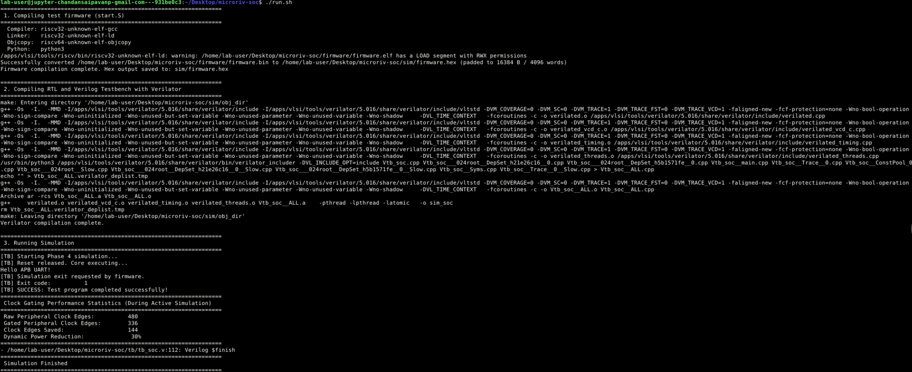
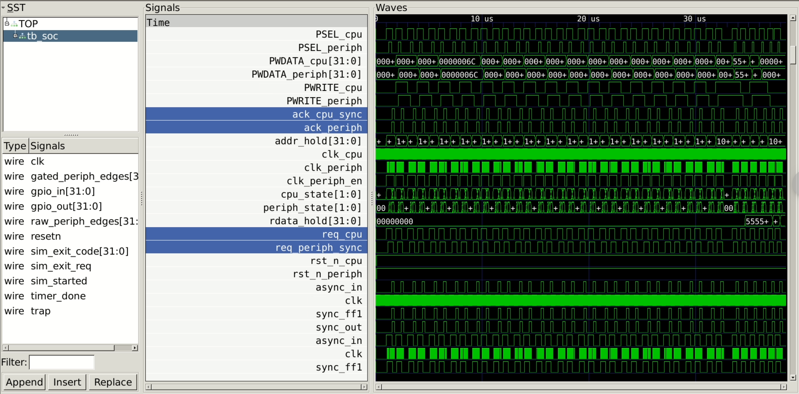
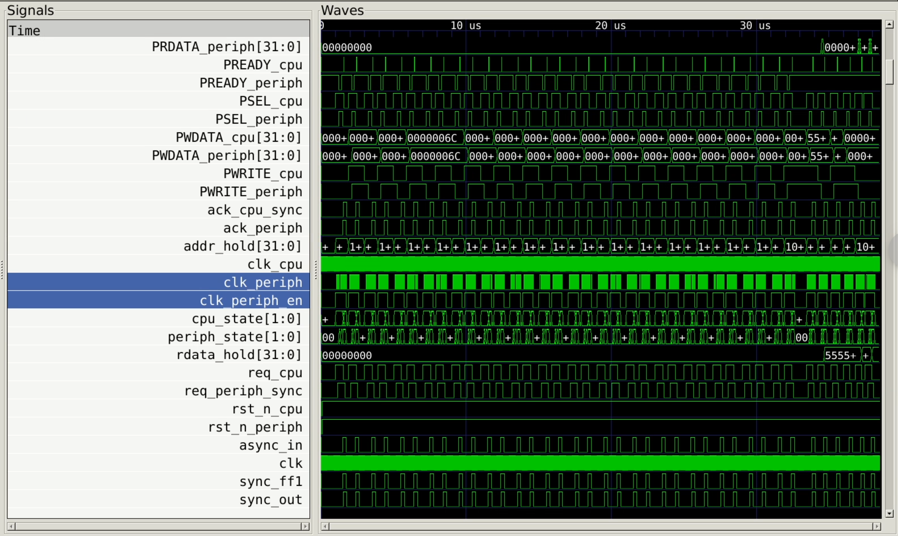
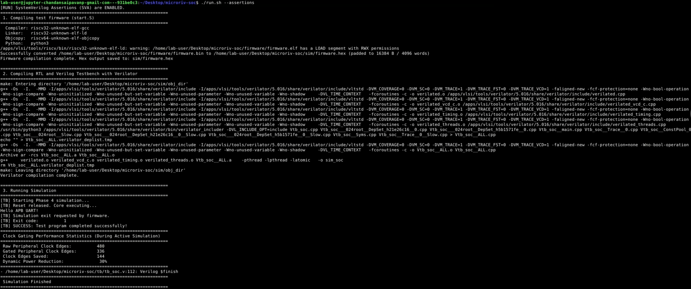
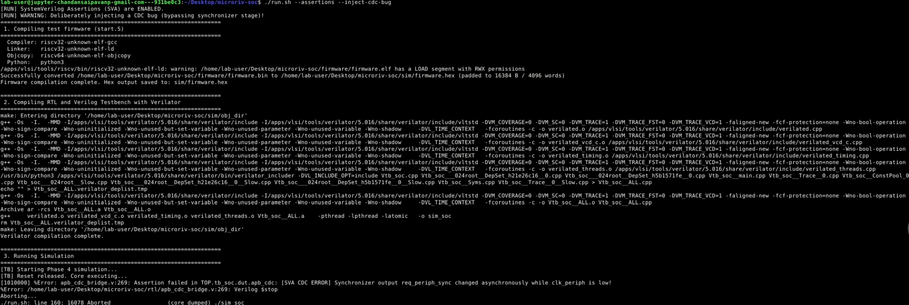

# MicroRiv SoC: A Low-Power, Verification-First RISC-V System-on-Chip

**MicroRiv SoC** is a simulation-first RISC-V System-on-Chip (SoC) designed with a strong focus on clock domain crossing (CDC) robustness, dynamic low-power clock gating, and comprehensive SystemVerilog Assertion (SVA) validation. It integrates a 32-bit RISC-V core with custom APB3 peripherals, crossing separate clock domains safely via a level-handshake synchronizer and gating clocks dynamically when the bus is idle.

---

## 1. System Architecture

The SoC is split into two clock domains and mapped across two logical power domains:
* **Always-On CPU Domain (`PD_CPU` @ 50 MHz)**: Houses the PicoRV32 RISC-V core, a 16KB system SRAM block, and the CPU side of the APB3 CDC bridge.
* **Gated Peripheral Domain (`PD_PERIPH` @ 12.5 MHz)**: Houses the UART, GPIO, and countdown Timer peripherals, the peripheral side of the CDC bridge, and a glitch-free Integrated Clock Gating (ICG) cell.

### ASCII Block Diagram

```text
+-------------------------------------------------------------------------------+
|                       Always-On Power Domain (PD_CPU)                         |
|                                                                               |
|  +--------------+                      +-------------------------+            |
|  |   PicoRV32   |    Native Memory Bus |   picorv32_apb_bridge   |            |
|  |   CPU Core   | -------------------> |      (APB3 Master)      |            |
|  +-------+------+                      +------------+------------+            |
|          |                                          |                         |
|     (SRAM Bus)                                      v                         |
|          v                                  +-------+-------+                 |
|     +----+----+                             |  cdc_bridge   |                 |
|     | 16KB RAM|                             | (CPU Domain)  |                 |
|     +---------+                             +-------+-------+                 |
|                                                     |                         |
+-----------------------------------------------------|-------------------------+
                                                      |
                                                      | CDC Boundary
                                                      v
+-------------------------------------------------------------------------------+
|             Gated Clock / Power-Gateable Power Domain (PD_PERIPH)             |
|                                                     |                         |
|                                             +-------+-------+                 |
|                                             |  cdc_bridge   |                 |
|                                             | (Periph Domain)                 |
|                                             +-------+-------+                 |
|                                                     |                         |
|  +-------------+  clk_periph_raw            +-------v-------+                 |
|  | clk_divider | -------------------------> |   icg cell    |                 |
|  +-------------+                            | (gated clock) |                 |
|                                             +-------+-------+                 |
|                                                     | gated_clk_periph        |
|                                                     v                         |
|                                            +--------v-------+                 |
|                                            | Peripheral Mux |                 |
|                                            +---+----+----+--+                 |
|                                                |    |    |                    |
|                                                v    v    v                    |
|                                              UART  GPIO Timer                 |
|                                                                               |
+-------------------------------------------------------------------------------+
```

---

## 2. Implemented Phases

* **Phase 1: Standalone Core Bring-up**: Integrated the PicoRV32 processor with a 16KB system RAM in a Verilator testbench environment.
* **Phase 2: APB3 Bus & Peripherals**: Designed an APB3 interconnect and integrated custom UART (loopback stub), GPIO (with output/input loopback), and countdown Timer IPs.
* **Phase 3: Multi-Clock Domain Split**: Implemented a register clock divider (divide-by-4) and a Level-Handshake APB3 CDC Bridge (`apb_cdc_bridge.v`) using 2-stage synchronizers to cross the CPU-to-peripheral boundary safely.
* **Phase 4: Low-Power Power Management**: Integrated a glitch-free, latch-based Integrated Clock Gating (ICG) cell on `clk_periph` controlled by CDC FSM activity, and authored a Unified Power Format (`power.upf`) domain script.
* **Phase 5: SVA Verification & Bug Injection**: Implemented SystemVerilog Assertions checking CDC correctness and APB compliance, with a macro-driven regression check that deliberately bypasses synchronizers to prove checker effectiveness.

---

## 3. Directory Structure

```
microriv-soc/
├── rtl/                   # System RTL Verilog/SystemVerilog sources
│   ├── picorv32.v         # Open-source PicoRV32 RISC-V core
│   ├── picorv32_apb_bridge.v # APB3 Master Bridge
│   ├── sync2_stage.v      # 2-stage D-FF synchronizer resolving metastability
│   ├── clk_divider.v      # Clock divider generating raw peripheral clock
│   ├── icg.v              # Glitch-free latch-based clock gating cell
│   ├── apb_cdc_bridge.v   # Level-Handshake APB3 CDC Bridge (with SVA assertions)
│   ├── apb_uart_bridge.v  # APB UART register decoder and transmitter stub
│   ├── uart.v             # Core UART serial engine
│   ├── apb_gpio.v         # 32-bit APB GPIO controller
│   ├── apb_timer.v        # 32-bit APB countdown Timer
│   └── soc_ram.v          # 16KB Byte-enabled SRAM block
├── tb/                    # Testbench files
│   └── tb_soc.v           # Verilog testbench wrapper generating clocks and counting edges
├── firmware/              # Bare-metal test firmware source
│   ├── start.S            # Startup assembly executing UART, GPIO, and Timer tests
│   ├── sections.lds       # Linker script mapping SRAM start (0x0000_0000)
│   └── makehex.py         # Python utility to convert binary ELF to $readmemh hex format
├── docs/                  # Architectural and project documentation
│   ├── architecture.md    # Detailed block diagrams, timings, and assertions checklist
│   ├── summary.md         # End-to-end project overview, bug logs, and synthesis next steps
│   ├── synthesis.md       # [NEW] RTL Synthesis script mapping and mapping strategies
│   └── screenshots/       # Directory containing waveforms and console output PNGs
├── synth/                 # [NEW] RTL Synthesis scripts, libraries, and reports
│   ├── gscl45nm.lib       # Target 45nm standard cell library definition
│   ├── synth.ys           # Yosys synthesis logic optimization script
│   ├── run_synth.sh       # Execution wrapper shell script
│   └── reports/           # Saved gate-level cell counts and schematics
├── power.upf              # Unified Power Format specification mapping power domains
└── run.sh                 # Unified compile-and-run bash shell script
```

---

## 4. Quickstart / How to Run

Navigate to the `microriv-soc` root directory and execute the following commands:

### A. Run Functional Simulation
Runs the baseline simulation with clock gating enabled:
```bash
./run.sh
```

### B. Run Simulation with Assertions Enabled
Compiles and executes the testbench with SystemVerilog Assertions compiled in:
```bash
./run.sh --assertions
```

### C. Run Deliberate CDC Bug Injection Check
Injects a deliberate CDC timing bug (bypassing the request synchronizer) and runs the assertions build:
```bash
./run.sh --assertions --inject-cdc-bug
```

### D. Run RTL Synthesis Flow
Compiles and synthesizes the physical hardware modules to a 45nm standard cell gate-level netlist:
```bash
chmod +x synth/run_synth.sh
./synth/run_synth.sh
```
*(Note: Requires Yosys. If Graphviz is installed on your environment, Yosys will also render top-level and CDC bridge schematics inside `synth/reports/`).*

---

## 5. Results & Waveforms

*Placeholder section for VCD wave captures and terminal results.*

#### 1. Simulation Console Output

*Figure 1: Terminal stdout showing firmware compiler output, Verilator compilation, successful execution of tests, and edge-saving metrics (showing a 30% active power reduction).*

#### 2. Clock Domain Crossing Handshake

*Figure 2: Waveform showing req_cpu transitioning high at 50 MHz, req_periph_sync asserting 2 clk_periph cycles later at 12.5 MHz, the APB peripheral transaction execution, and the synchronized return handshake via ack_periph/ack_cpu_sync.*

#### 3. Dynamic Clock Gating Transition

*Figure 3: Glitch-free clock-gating waveforms, showing clk_out remaining gated low when idle, and transitioning cleanly on/off based on the latch-synchronized enable signal (req_cpu || ack_periph) without pulse truncations.*

#### 4. Baseline Assertion Passing Run

*Figure 4: Terminal printout showing the simulation compiling and executing end-to-end with all SVA CDC and protocol assertions passing cleanly.*

#### 5. Assertion Failure on CDC Bug Injection

*Figure 5: Terminal printout proving that the SVA checkers actively catch design errors; when the request synchronizer is bypassed, the simulation immediately aborts with a CDC synchronizer error.*

---

## 6. Bugs Found & Fixed Log

| Bug Description | Integration Phase | Root Cause | Structural Fix |
| :--- | :---: | :--- | :--- |
| **Duplicate APB Transactions** | Phase 2 | CPU memory bus held `mem_valid` high for multiple cycles, causing the APB bridge to launch duplicate background transfers. | Added an `!mem_ready` check to the bridge's transition from `STATE_IDLE` to prevent repeating transfers. |
| **UART Character Duplication** | Phase 2 | `tx_write` and `tx_data` registers held write enable high over multiple cycles, writing the same character repeatedly. | Changed `tx_write` and `tx_data` to wires driven combinatorially by active `PREADY` to trigger for exactly one clock edge. |
| **Firmware Assembly Hex Literals** | Phase 2 | Assembler rejected underscore notation (e.g. `0x8000_0004`), treating them as bignum formats. | Replaced underscores with clean literals (e.g. `0x80000004`) in `start.S`. |
| **Verilator `SYNCASYNCNET` Linter Warning** | Phase 2 / 3 | Testbench exit monitoring logic sampled `resetn` directly across asynchronous domain regions. | Added a separate clock-aligned `sim_started` register in `tb_soc.v` to gate the exit condition checker. |
| **ICG Latch Assert Fails** | Phase 5 | Assertion 8 incorrectly compared latch value changes across clock cycles (`$stable` check), failing when clock gating transitioned. | Removed the cycle-to-cycle check, relying on Assertion 9 which checks that latch output remains static while the clock is high. |
| **Handshake Implication Assert Fails** | Phase 5 | Handshake assert verified `req_cpu == 0` during the same cycle `ack_cpu_sync` went high, violating FSM sequential delay. | Modified assertion to `(ack_cpu_sync && !req_cpu) |=> !req_cpu` to evaluate correctly on FSM cleanup state. |

---

## 7. Verification Methodology

### Assertions Core Checks
We use SVA concurrent properties and synthesizable checkers to verify:
1. **CDC Data Stability**: Latched addresses and data remain static and unchanged throughout the transaction flight (between `req_cpu` rising and `ack_cpu_sync` returning).
2. **Handshake Protocol Safety**: `req_cpu` is held high until `ack_cpu_sync` is seen, and cannot re-assert until the previous transaction has cleared.
3. **APB3 Compliance**: `PSEL` is held high and `PADDR`/`PWRITE`/`PWDATA` are kept completely static during the entire active `PENABLE` phase.
4. **Glitch-Free Gating**: The latch enable inside `icg.v` remains stable and cannot change value while the raw input clock is high.
5. **Bus Hang Protection**: A watchdog counter asserts a simulation error if a peripheral slave holds `PREADY` low for more than 100 clock cycles.

---

## 8. RTL Synthesis & Next Steps

We have set up a complete **Yosys synthesis flow** mapped to the 45nm `gscl45nm` library. Running `./synth/run_synth.sh` produces:
* A gate-level Verilog netlist (`synth/netlist.v`).
* Mapped cell count reports and latch inference logs (`synth/reports/stats.txt`).
* Rendered schematics of `soc_top` and `apb_cdc_bridge` module topologies (`synth/reports/*.svg`).

For details on cells, memory/latch mapping warnings, and gate area metrics, see the **[RTL Synthesis Report](docs/synthesis.md)**.

### Honest UPF & Memory Caveats
1. **UPF**: `power.upf` is a **conceptual power-intent specification** for ASIC synthesis tools (e.g., Design Compiler). Verilator ignores UPF power states natively. Clock gating logic and edge statistics are fully simulated and verified.
2. **SRAM**: The 16KB SRAM block (`soc_ram.v`) is initialized with `$readmemh` in simulation, which is bypassed during synthesis using a `SYNTHESIS` preprocessor macro. Yosys infers `soc_ram` as an abstract memory block. In a physical tape-out, this is replaced by SRAM macros compiled with memory compilers or FPGA BRAM slices.

### FPGA / ASIC Path
To tape-out this SoC or target an FPGA board:
1. **PDK Technology Mapping**: Swap `gscl45nm.lib` with a physical silicon PDK standard cell library (e.g., SkyWater 130nm).
2. **ICG Hardware Cells**: Replace the generic transparent latch inside `icg.v` with physical clock-gating cells from the target library (e.g., `sky130_fd_sc_hd__dlcglo_1`) or FPGA clock buffers (`BUFGCE`).
3. **Reset Synchronizer Integration**: Add clock-aligned reset synchronizers to safely release reset across both domains.

---

## 9. Credits & References

* **PicoRV32 Core**: Designed by Clifford Wolf (YosysHQ) [Github Link](https://github.com/YosysHQ/picorv32).
* **Peripherals**: Initial UART, GPIO, and Timer IP designs adapted from NIELET bootcamp integration labs.
* **License**: Open-source MIT hardware license.
